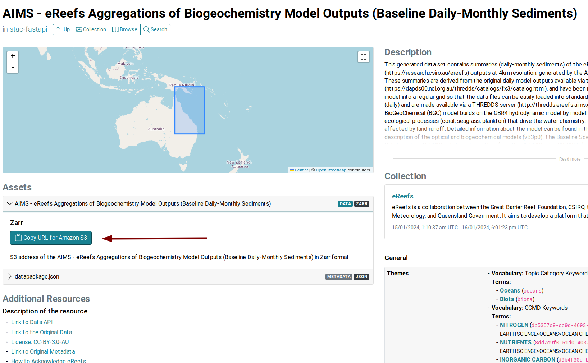

# AIMS Training Workshop

### November 2024

## Goal

To use the [GBR Data Management System (DMS)](https://stac.reefdata.io/browser/?.language=en) to extract and analyse data from selected datasets hosted in the DMS. Note that you will need to have a GBR DMS account to access data.

## Useful links

IMOS DMS webpage: [GBR Data Management System](https://imos.org.au/data/access-ocean-data/great-barrier-reef-data-management-system)
Dataset catalogue: DMS [STAC](https://stac.reefdata.io/browser/?.language=en) browser
Repository of examples: [GBR DMS Examples](https://github.com/aodn/rimrep-examples)
DMS technical documentation: [GBR DMS Technical Documentation](https://github.com/aodn/rimrep-documentation)
AODN Data portal (non-DMS): [AODN Data Portal](https://portal.aodn.org.au/)
AODN metadata catalogue: [AODN Catalogue](https://catalogue-imos.aodn.org.au/geonetwork/srv/eng/catalog.search#/home)

### Venue: AIMS Townsville 

## Agenda
  
| Time  | Activity |
|-------|:---------------------------------------------------------------|
| 09:00 | Introduction and workshop goals                               |
| 09:15 | The GBR Data Management System (DMS): What is it and what services are available |
| 09:45 | General coding tools and best practices in R and Python  |
|       | 1. How to write a reproducible R script                          |
|       | 2. How to understand and report errors in R                   |
|       | 3. How to ask for help: The importance of reproducible examples |
| 10:30 | Morning tea break                                             |
| 10:15 | How to use the DMS: guided examples                           |
| 12:00 | Lunch break                                                   |
| 13:00 | Breakout session: work with selected use cases              |
| 15:00 | Afternoon tea break                                           |
| 15:15 | Breakout session: work with selected use cases (cont.)             |
| 16:00 | Presentation of results and discussion                        |
| 16:30 | Closure                                                  |
  
**NOTE:** Please read the [Pre-event Instructions](https://github.com/aodn/rimrep-training/blob/main/Pre-Event%20Instructions.pdf) before you attend the workshop to avoid delays on the day. You will likely need to install some `R` packages on your computer to run the examples.  
 
## How to use DMS services and data

The GBR DMS provides three ways to search for public data: a **metadata catalogue**, a **public AWS S3 repository of datasets**, and a **data API**. Click on the titles below to find more information about each of these methods.

Also note that while the majority of datasets in the DMS are publicly available, the DMS also manages non-public datasets that could be accessed after authorisation from the original data provider. This is the reason why DMS users need an account to access this system.

<details>

<summary><b>The STAC metadata catalogue</b></summary>

The metadata catalogue is the discovery portal. The datasets are organised as *items* inside **collections**. A **collection** is a group of similar *items* (datasets) either maintained by the same data provider (e.g., GBRMPA), or it can also refer to a similar type of data. For example, GBRMPA maintains a set of administrative regions (e.g., GBR marine protected area boundaries) and another for natural features (e.g., reefs inside the boundaries of the GBR). Both of these datasets (*items*) are included under the same **collection** ([GBRMPA Administrative Spatial Regions](https://stac.reefdata.io/browser/collections/gbrmpa-admin-regions)).

In the DMS, you can search for datasets by their name or using keywords. This search will return any collections that contain items related to your query. You can further search filter results by selecting one of the collection and searching by temporal/spatial extent and names. This will return a set of items (within the chosen collection) that fits your query.

</details>

<details>

<summary><b>The AWS S3 public repository</b></summary>

All DMS datasets are stored in an Amazon AWS S3 public repository. If you know the location of the collection (the S3 URI) you can use this address to connect directly with the dataset. The S3 URI is provided in the [STAC](https://stac.reefdata.io/browser/) *item* page inside a **collection**.



</details>

</details>

<details>

<summary><b>The data API</b></summary>

The data API services are provided through [pygeoapi](https://pygeoapi.io) a server implementation of a set of [OGC API standards](https://ogcapi.ogc.org). This service allows you to extract data from every collection using simple filters like time and space. Note that given that not all datasets in the DMS are publicly available, DMS users will need to an **Access Token** to access the DMS API services.

If you need access to the API services, contact the DMS team by emailing [info-dms\@utas.edu.au](mailto:info-dms@utas.edu.au). We will create a unique set of `CLIENT_ID` and `CLIENT_SECRET` that you can use to create an **Access Token** following the instructions in the next section of this document. Note that the `CLIENT_ID` and `CLIENT_SECRET` should be considered private information, just like a password. This is because these identifiers are linked to a user profile that defines the private datasets you are granted permission to access.

### Using the data API: How to get an access token

For human users, you need to login into the DMS system by accessing the [login](https://dashboard.reefdata.io) dashboard](<https://dashboard.reefdata.io>). Then, go to the same page again and copy the access token. You are ready to paste the token value into a variable, preferably an environment variable.


  
If you are planning to use a Machine-to-Machine workflow, there are several ways you can request an access token. The DMS admin needs to create a "machine client" for you and provide user credentials: `client_id` and `client_secret`. These credentials should not be shared with others, you must store them in a secure way. Once you have your user credentials, you can generate an **access token** using command line commands or inside your code. Note that the **access token** is only valid for one hour, so it is possible that you need to request a new token for each new API call.  
  
Below, we include instructions about how to create this **access token** in `R` and the command line:
 
<details>

<summary><b>R</b></summary>

Included in this folder, you will find a file called `useful_functions.R`. This file includes a collection of functions that you may find useful when accessing data in the DMS. One of the functions we are including is `dms_token`, which requests an access token using your DMS user credentials.

In the chunk below, we assume that you have stored your user credentials as environmental variables in `R`. If you have not, we have instructions on how to set environmental variables under the [Notebooks](#notebooks) section further down in this document.

``` r
#Loading DMS custom made functions
source("R_notebooks/useful_functions.R")

#Get access token
token <- dms_token(Sys.getenv("CLIENT_ID"), Sys.getenv("CLIENT_SECRET"))
```

In the code above, the access token will be stored in `token` variable.

</details>

<details>

<summary><b>Command Line Interface</b></summary>

It is recommended to store the `CLIENT_ID` and `CLIENT_SECRET` as environmental variables. Assuming that you have already defined these environmental variables, you can request an access token using the following command:

``` bash
ACCESS_TOKEN=$(curl --location --request POST "https://keycloak.reefdata.io/realms/rimrep-production/protocol/openid-connect/token" -s \
  --header "Content-Type: application/x-www-form-urlencoded" \
  --data-urlencode "client_id=$CLIENT_ID" \
  --data-urlencode "client_secret=$CLIENT_SECRET" \
  --data-urlencode "grant_type=client_credentials" | jq -r '.["access_token"]')
```


</details>

</details>

## Use case examples
We will be working on the following use case examples:

1. Extract a time series for a variable of interest for a point, reef, or region  
2. Calculate the Maximum Monthly Mean (MMM) for sea surface temperature (SST)  
3. Calculate DHW and DHD for a reef or region

## Notebooks

We will create a series of notebooks to guide you through the process of accessing and analysing data from the DMS according to your preferences. These notebooks will be available in this repository. Depending on the demand, we will create notebooks in `R` and `Python`. You can see some examples in [this repository](https://github.com/aodn/rimrep-examples/). 
  
To keep the DMS secure and to allow for different access levels to non-public datasets via the API, we provide DMS users with unique credentials. To access the API, users must generate an access token using their credentials. These token last one hour and while current, users are able to access any public datasets in the DMS, as well as any non-public dataset for which they have been granted permission. User credentials should be treated similar to passwords and they should not be shared.

To ensure you do not accidentally share your user credentials within a script, we recommend that you store this information as environmental variables in `R`. You can create these environmental variables as follows:

``` r
#Create or update the environmental variable 
Sys.setenv("CLIENT_ID" = "paste_CLIENT_ID_here")
Sys.setenv("CLIENT_SECRET" = "paste_CLIENT_SECRET_here")

#Check environmental variable has been corrected created/updated
Sys.getenv(c("CLIENT_ID", "CLIENT_SECRET"))
```
  
Note that the credentials must be given within quotation marks, for example: `"client_id123"`. If you provide the token as `client_id123`, that is without quotation marks (`""`), you will get an error.   
  
Setting environmental variables in this way will only save them for the duration of your `R` session. If you would like to store them permanently, you can use `usethis::edit_r_environ()` function. This will open a file called `.Renviron` in a new tab in your RStudio session. Copy and paste your credentials as shown below.  
  
```
CLIENT_ID = "paste_CLIENT_ID_here"
CLIENT_SECRET = "paste_CLIENT_SECRET_here"
```

Save your changes, close the tab, and restart your `R` session for changes to take effect.

We will provide credentials to every participant prior to the workshop.


## Use Cases

In the afternoon session, we will work on some the following use cases. We will provide the URI of the datasets that you will need to access in the DMS to complete these tasks. Any use case can be completed using either `R` or `Python`.

### Use Case 1: Extract a time series for a variable of interest for a point, reef, or region
**Description**: Extract a time series for a point, reef, or region. You can choose any variable of interest (e.g., SST, chlorophyll-a, salinity, etc.) and any location (point, reef, or region). 

### Use Case 2: Calculate the Maximum Monthly Mean (MMM) for sea surface temperature (SST)
**Description**: Calculate the Maximum Monthly Mean (MMM) for sea surface temperature (SST) for a point, reef, or region. This implies calculating the DHW from any temperature source you choose. The climatology could be calculated from the same dataset or from a different one, like NOAA climatology or SSTAARS

### Use Case 3: Calculate DHD (*à la BOM*) for a reef or region
**Description**: Calculate the Degree Heating Days (DHD) for a reef or region. This implies calculating the temperature anomlaies from any temperature source you choose. The climatology could be calculated from the same dataset or from a different one, like NOAA climatology or SSTAARS.

### Use Case 4: Extract variables from LTMP modelled output and correlate with environmental data.
**Description**: Extract variables from the Long Term Monitoring Program (LTMP) modelled output and correlate with environmental data. You can choose any variable of interest (e.g., SST, chlorophyll-a, salinity, etc.) and any location (point, reef, or region).

### Use Case 5: Extract NRT data from AIMS Weather Stations and correlate with BOM AUSWave prediction forecasts.
**Description**: Extract NRT data from AIMS Weather Stations and correlate with BOM AUSWave prediction forecasts. You can choose any location (point, reef, or region).

### Use Case 6: Calibrate eReefs modelled data with in-situ data.
**Description**: Calibrate eReefs temperature modelled data with in-situ data. You will use AIMS Temperature Loigger program for selected sites to perform the calibration.

### Use Case 7: Explore the relatiponship between GBR users perpectives and environmental and biological data.
**Description**: Explore the relatiponship between GBR users perpectives and environmental and biological data. You can use the SELTMP user survey data and correlate with environmental data, like heating indicators and biological data form LTMP modelled output.

### Use Case 8: Explore NRT water quality data from DES and extract timeseries and anomalies.
**Description**: Explore NRT water quality data from seven different locations. Correlate with Chla estimates. 
